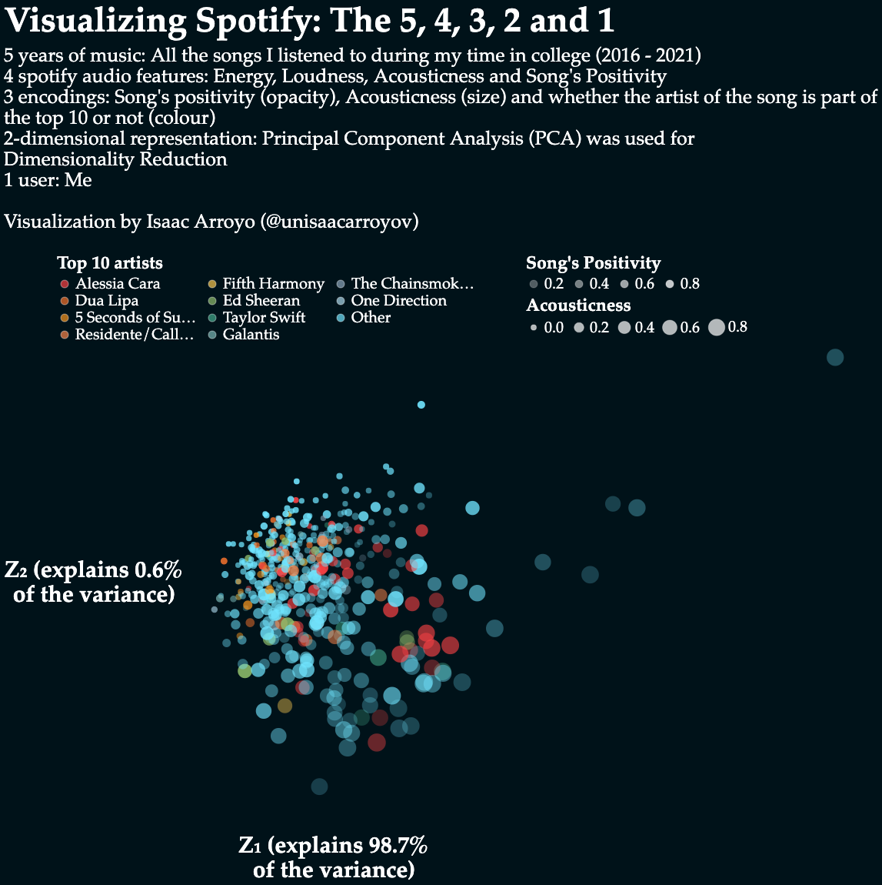

# Altair - Gallery
...
## Visualizing Spotify
### The 5, 4, 3, 2 and 1

## Visualizing temperatures 02 (Working on it... :hourglass_flowing_sand:)
This work is made to compare the outputs of similar plots made with different libraries and programming languages.
In the meantime, check out the first plot made with **R** [here](https://github.com/isaacarroyov/data_visualization_practice/tree/master/R#visualizing-temperatures-01)
