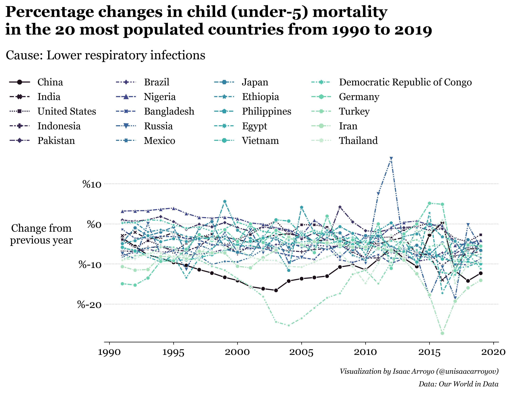

# Matplotlib + Seaborn – Gallery
## Visualizing Our World in Data
### Child mortality (Spanish tutorial)
Spanish tutorial focused on data wrangling and data visualization with **Matplotlib** and **Seaborn**.

> En la _Jupyter Notebook_ se encuentra todo el proceso para la generación de la visualización final. 
> Esta documentado desde la manipulación de los datos con **Pandas** hasta consejos para mejorar las 
> visualizaciones en **Matplotlib** y **Seaborn**.

[**Jupyter notebook (English version :arrow_right: last cell)**](https://github.com/isaacarroyov/data_visualization_practice/blob/master/Matplotlib_Seaborn/visualizing_our_world_in_data/01_child_morality.ipynb)