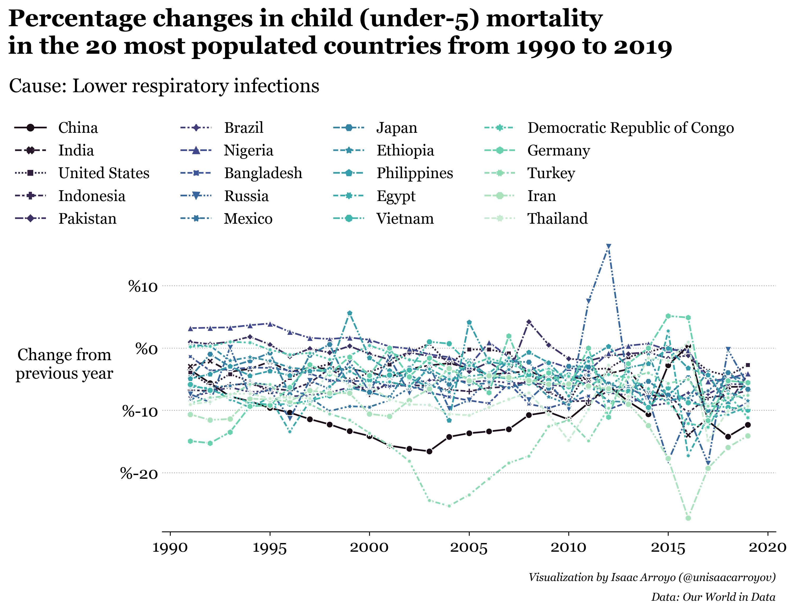
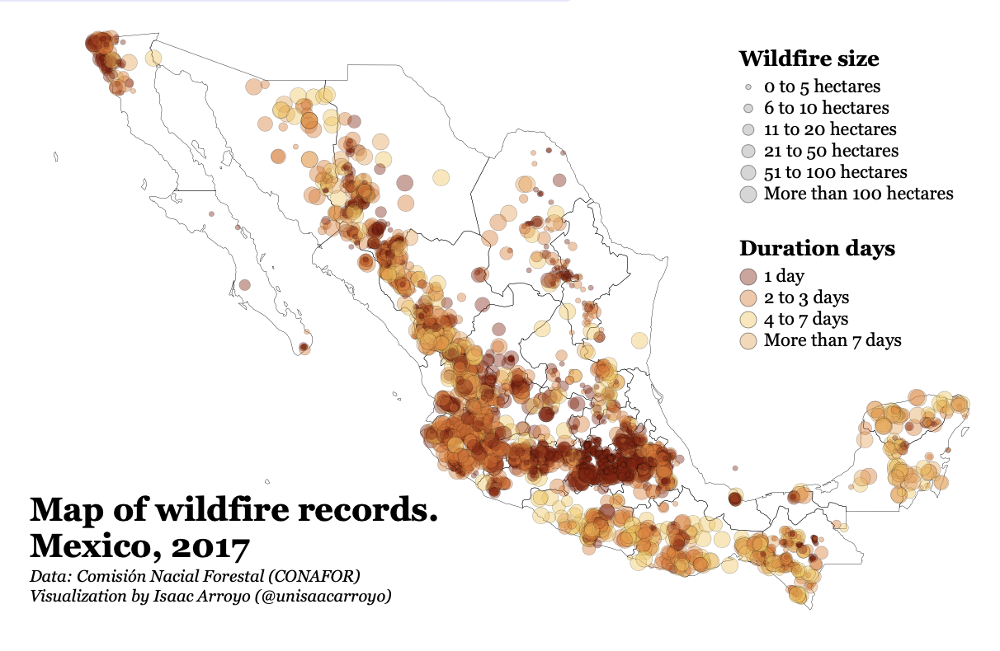

# Python – Gallery
## Visualizing Our World in Data
### Child mortality (`Matplotlib`)
Spanish tutorial focused on data wrangling and data visualization with **Matplotlib** and **Seaborn**.

> En la _Jupyter Notebook_ se encuentra todo el proceso para la generación de la visualización final. 
> Esta documentado desde la manipulación de los datos con **Pandas** hasta consejos para mejorar las 
> visualizaciones en **Matplotlib** y **Seaborn**.

[_**Jupyter notebook**_](https://github.com/isaacarroyov/data_visualization_practice/blob/master/Python/visualizing_our_world_in_data/01_child_morality.ipynb)

## Visualizing Science
Learning about science was difficult at the beginning until I found out that I could understand and 
_memorize_ most of the concepts if I imagined them.

Enjoy the visualizations! :sparkles:
### Line Integral on a Vector Field (Mathematics)

[**Code**](https://github.com/isaacarroyov/data_visualization_practice/blob/master/Python/visualizing_science/Mathematics/scientific_visualization_math_line-integral-vector-field.py)

## Visualizing Wildfires
### Interactive maps
Interact with the maps [here](https://datapane.com/u/unisaacarroyov/reports/VkBgrZA/visualizing-wildfires-01/)

[**Code**](https://github.com/isaacarroyov/data_visualization_practice/blob/master/Python/visualizing_wildfires/visualizing_wildfires_01.ipynb)