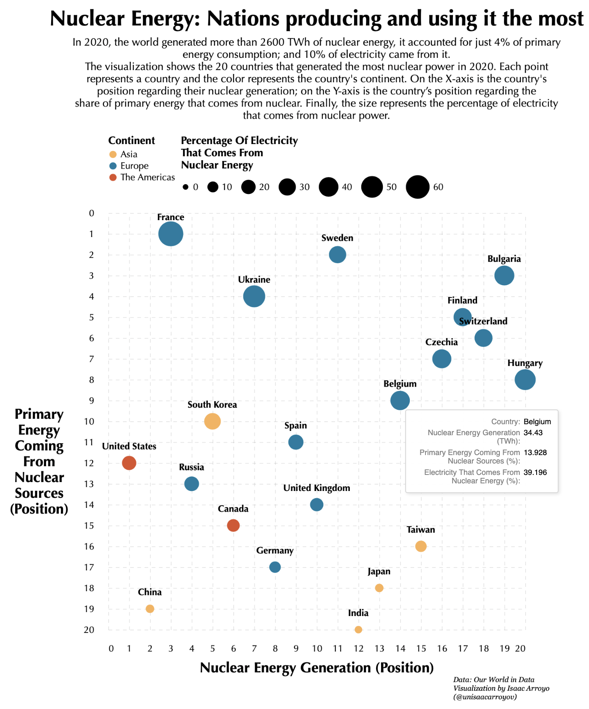
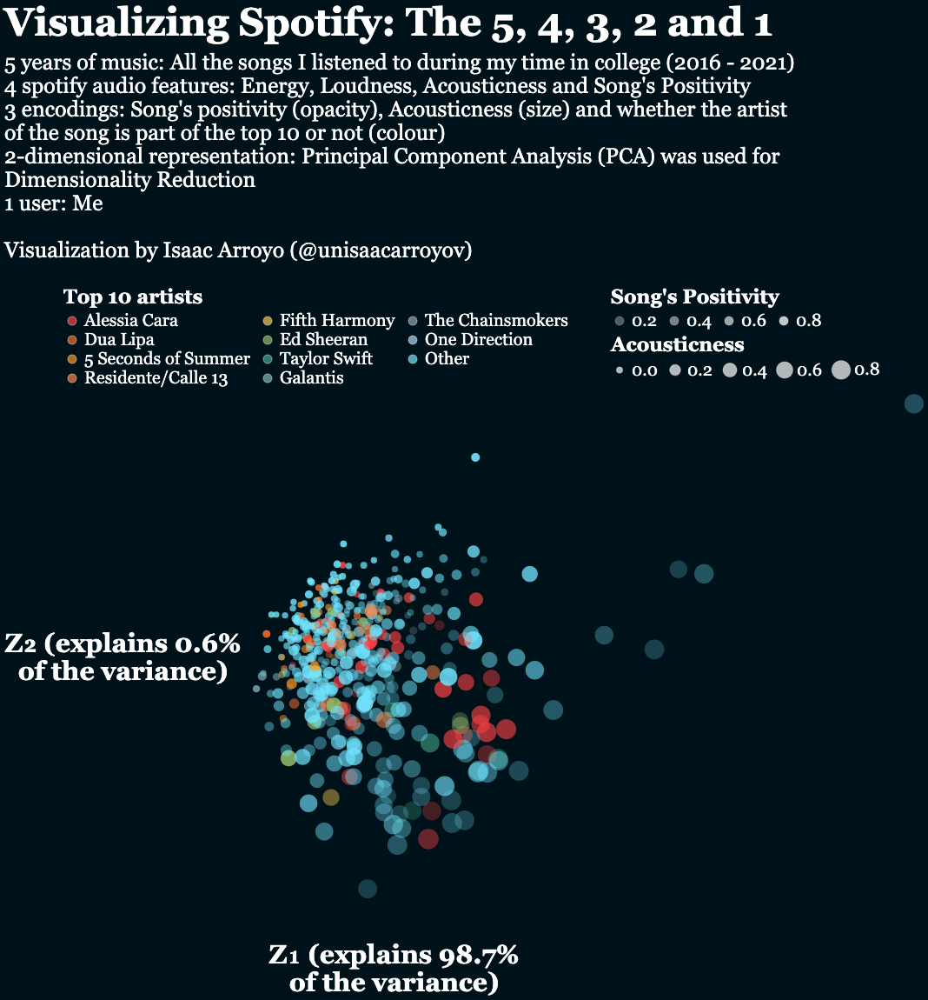
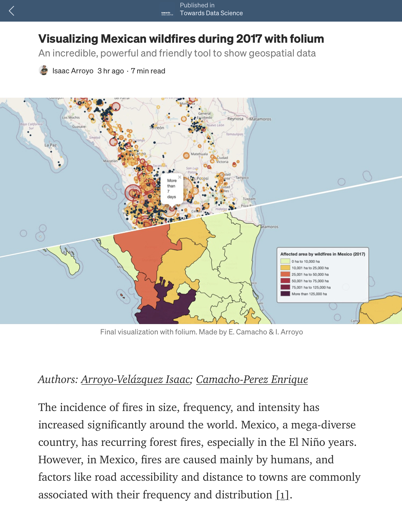

# Python – Gallery

## Interactive chart: Nuclear Energy
Created an interactive chart based on the Bloomberg's article 
[_"Nuclear Power Gets a Fresh Look as Nations Chase Climate Goals"_](https://www.bloomberg.com/news/articles/2022-01-10/nuclear-power-reactors-could-be-way-for-nations-to-achieve-climate-goals).

[**Code**](https://github.com/isaacarroyov/data_visualization_practice/blob/master/Python/task_bloomberg/task_bloomberg_01.ipynb)  
[**_Interactive chart (HTML)_**](https://github.com/isaacarroyov/data_visualization_practice/blob/master/Python/task_bloomberg/task_bloomberg_chart_01.html)

## Visualizing Our World in Data
### Child mortality (`Matplotlib`)
Spanish tutorial focused on data wrangling and data visualization with **Matplotlib** and **Seaborn**.

> En la _Jupyter Notebook_ se encuentra todo el proceso para la generación de la visualización final. 
> Esta documentado desde la manipulación de los datos con **Pandas** hasta consejos para mejorar las 
> visualizaciones en **Matplotlib** y **Seaborn**.
  
[_**Jupyter notebook**_](https://github.com/isaacarroyov/data_visualization_practice/blob/master/Python/visualizing_our_world_in_data/01_child_morality.ipynb)

## Visualizing Science
Learning about science was difficult at the beginning until I found out that I could understand and 
_memorize_ most of the concepts if I imagined them.

Enjoy the visualizations! :sparkles:
### Line Integral on a Vector Field (`Matplotlib`)
  
[**Code**](https://github.com/isaacarroyov/data_visualization_practice/blob/master/Python/visualizing_science/Mathematics/scientific_visualization_math_line-integral-vector-field.py)

## Visualizing Spotify
### The 5, 4, 3, 2 and 1 (`Alatair`)
Thanks to the marketing campaing **Spotify's Wrapped**, many of us share a summary of what we've been listening 
to throughout the year. Just like every **summary**, there's **data** in the process in the making. Here, I'm 
presenting you a **visual summary** of some of **my Spotify's Wrapped playlists**
  
[**Interactive chart**](https://datapane.com/u/unisaacarroyov/reports/E7Pwzy3/visualizing-spotify-the-5-4-3-2-and-1/)  
[**Jupyter notebook**](https://github.com/isaacarroyov/data_visualization_practice/blob/master/Python/visualizing_spotify/visualizing_spotify_01-01_pca.ipynb)

## Visualizing Wildfires
### Interactive maps (`Alatair`)
Interact with the maps [here](https://datapane.com/u/unisaacarroyov/reports/VkBgrZA/visualizing-wildfires-01/)  
  
[**Jupyter notebook**](https://github.com/isaacarroyov/data_visualization_practice/blob/master/Python/visualizing_wildfires/visualizing_wildfires_01.ipynb)
### Visualizing Mexican Wildfires during 2017 :arrow_right: Towards Data Science – Medium post (`Folium`)

[**Project**](https://github.com/isaacarroyov/data_visualization_practice/tree/master/Python/visualizing_mexican_wildfires_tds)
