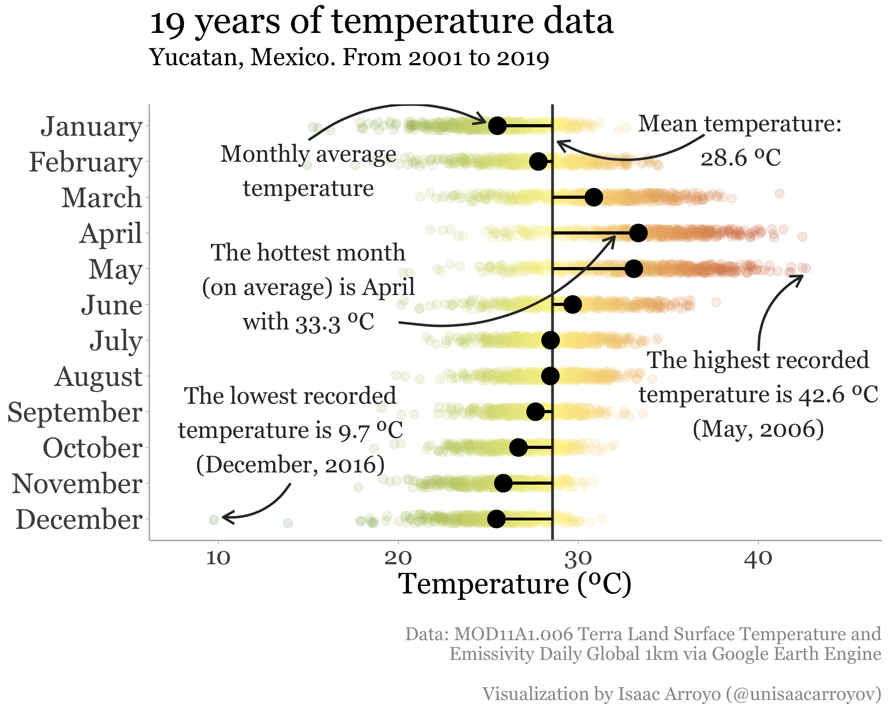

# R – Gallery
## Visualizing temperatures 01
This work is made to compare the outputs of similar plots made with different libraries and programming languages.
The other plot is going to be made with Python + Altair ([here](https://github.com/isaacarroyov/data_visualization_practice/tree/master/Altair#visualizing-temperatures-02-working-on-it-hourglass_flowing_sand))

[_**Source code**_](https://github.com/isaacarroyov/data_visualization_practice/blob/master/R/visualizing_temperatures/visualizing_temperatures_01.R)

## Visualizing Spotify 02
### The 5, 4, 3, 2 and 1
Thanks to the marketing campaing **Spotify's Wrapped**, many of us share a summary of what we've been listening 
to throughout the year. Just like every **summary**, there's **data** in the process in the making. Here, I'm 
presenting you a **visual summary** of some of **my Spotify's Wrapped playlists**.

You can also see the chart made with Python + Altair [here](https://github.com/isaacarroyov/data_visualization_practice/tree/master/Altair#the-5-4-3-2-and-1)

[_**Source code**_](https://github.com/isaacarroyov/data_visualization_practice/blob/master/R/visualizing_spotify/visualizing_spotify_01-02_pca.R)

## Visualizing Wildfires
### with Cartograms
Visualize this plot and the details in Behance ([here](https://www.behance.net/gallery/138741291/Visualizing-wildfires)). 
Also, the interactive version [here](https://github.com/isaacarroyov/data_visualization_practice/tree/master/Altair#interactive-maps)

[**Source code**](https://github.com/isaacarroyov/data_visualization_practice/blob/master/R/visualizing_wildfires/visualizing_wildfires_01.R)