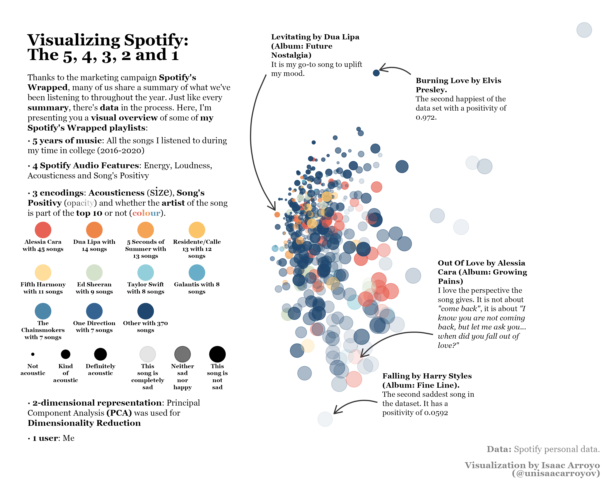
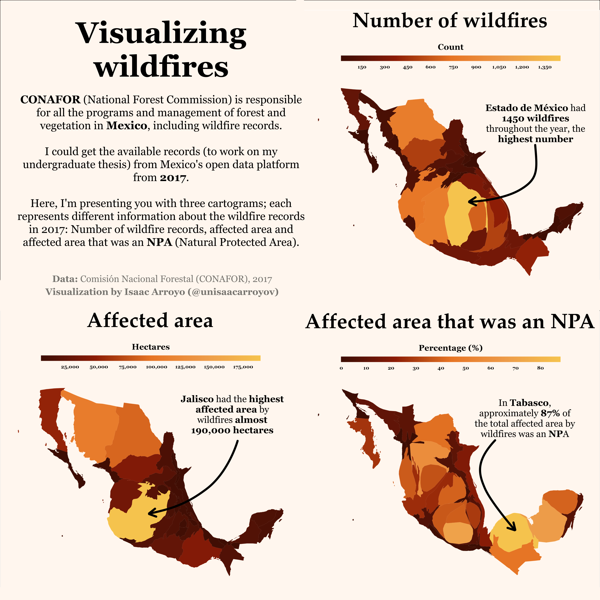

# R – Gallery
## Visualizing environmental data in Yucatan, Mexico
### Part I: Temperature, soil moisture and drought severity
These chart are the individual version of a _bigger_ data visualization project called [**"20 years of environmental data in Yucatan, Mexico"**](https://www.behance.net/gallery/140490559/20-years-of-environmental-data)
the complete data visualization is my [Behance profile](https://www.behance.net/unisaacarroyov).

[_**Code**_](https://github.com/isaacarroyov/data_visualization_practice/blob/master/R/visualizing_environmental_data/visualizing_environmental_data_individuals_charts_2001_2020.R)

### Visualizing temperatures
_This is the "old" project_

[_**Code**_](https://github.com/isaacarroyov/data_visualization_practice/blob/master/R/visualizing_environmental_data/visualizing_temperatures_01.R)

## Visualizing Spotify
### The 5, 4, 3, 2 and 1
Thanks to the marketing campaing **Spotify's Wrapped**, many of us share a summary of what we've been listening 
to throughout the year. Just like every **summary**, there's **data** in the process in the making. Here, I'm 
presenting you a **visual summary** of some of **my Spotify's Wrapped playlists**.

You can also see the chart made with Python + Altair [here](https://github.com/isaacarroyov/data_visualization_practice/tree/master/Altair#the-5-4-3-2-and-1)

[_**Code**_](https://github.com/isaacarroyov/data_visualization_practice/blob/master/R/visualizing_spotify/visualizing_spotify_01-02_pca.R)

## Visualizing Wildfires
### with Cartograms
Visualize this plot in Behance ([here](https://www.behance.net/gallery/138741291/Visualizing-wildfires)). In order to create the final product 
I had to used [**Vectornator**](https://www.vectornator.io), an illustration software. 

I invite you to check out the interactive version [here](https://github.com/isaacarroyov/data_visualization_practice/tree/master/Altair#interactive-maps)

[**Code**](https://github.com/isaacarroyov/data_visualization_practice/blob/master/R/visualizing_wildfires/visualizing_wildfires_01.R)