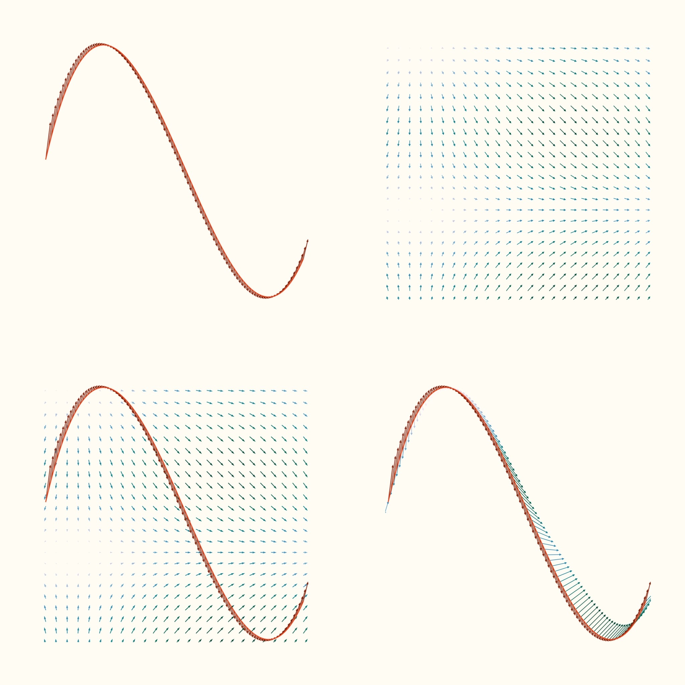

# Visualizing Science
Learning about science was difficult at the beginning until I found out that I could understand and 
_memorize_ most of the concepts if I imagined them.

Enjoy the visualizations! :sparkles:

# Gallery
## Mathematics 
### Line Integral on a Vector Field
_Visualize it on Behance! ([here](https://www.behance.net/gallery/138428475/Visualizing-Science-Mathematics-Line-Integral))_

[_**Source code**_](https://github.com/isaacarroyov/data_visualization_practice/blob/master/Scientific_Visualization/Mathematics/scientific_visualization_math_line-integral-vector-field.py)

